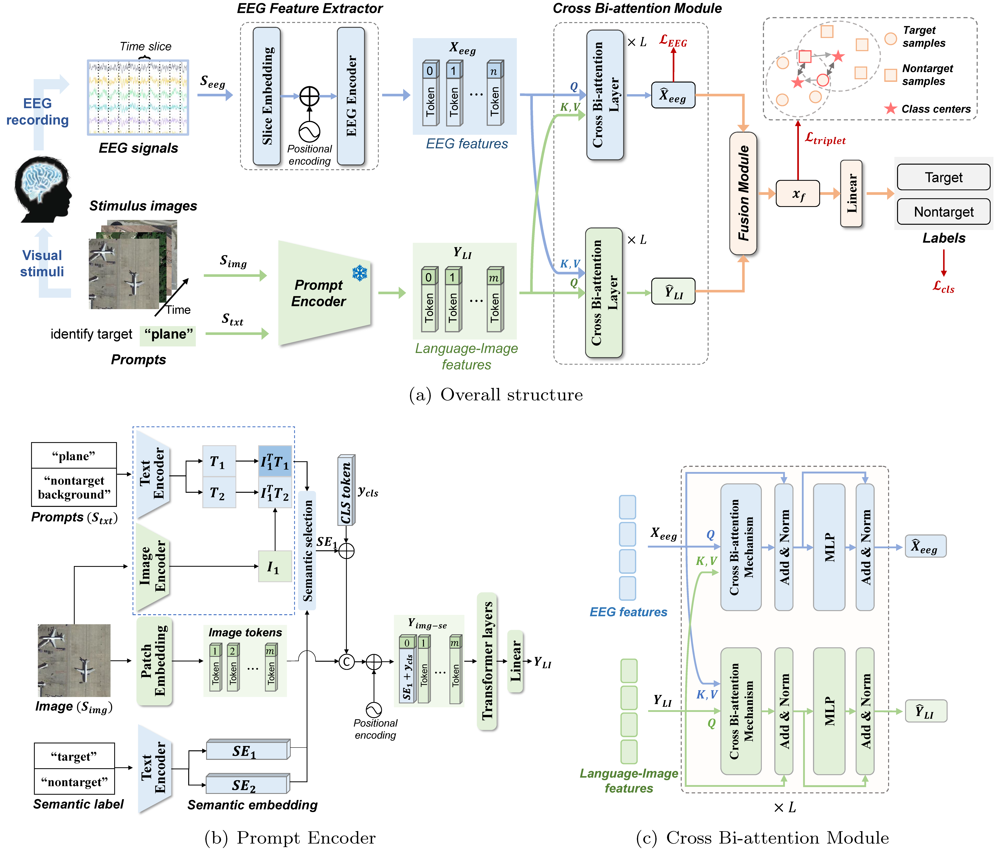

# ELIPformer

The official implementation of **Integrating Language-Image Prior into EEG Decoding for Cross-Task Zero-Calibration RSVP-BCI**.




## 1&nbsp; Installation

Follow the steps below to prepare the virtual environment.

Create and activate the environment:
```shell
conda create -n mtreenet python=3.10
conda activate ELIPformer
```

Install dependencies:
```shell
pip install -r requirements.txt
```


## 2&nbsp; Data

### 2.1&nbsp; Dataset

Our collected dataset and corresponding data descriptions are released at [https://doi.org/10.57760/sciencedb.14812](https://doi.org/10.57760/sciencedb.14812).

Each participant's **electroencephalogram (EEG) data** are stored in `.npz` files, and **stimulus images** are also stored in `.npz` files. Each EEG and image file with the same file name corresponds to the same participant. Below is the dataset structure:

| Task | Modality | File Format | File Naming | Data Shape | Label Description |
|------|----------|-------------|-------------|------------|-------------------|
| Plane    | EEG      | `.npz`       | `S1.npz` ~ `S20.npz` | `(trials × channels × time)` | `0`: non-target, `1`: target |
| Plane    | IMG       | `.npz`       | `S1_1.npz` ~ `S20_2.npz` | `(trials × 3 × height × width)` | `0`: non-target, `1`: target |
| Car    | EEG      | `.npz`       | `S1.npz` ~ `S20.npz` | `(trials × channels × time)` | `0`: non-target, `1`: target |
| Car    | IMG       | `.npz`       | `S1_1.npz` ~ `S20_2.npz` | `(trials × 3 × height × width)` | `0`: non-target, `1`: target |
| People    | EEG      | `.npz`       | `S1.npz` ~ `S31.npz` | `(trials × channels × time)` | `0`: non-target, `1`: target |
| People    | IMG       | `.npz`       | `S1_1.npz` ~ `S31_2.npz` | `(trials × 3 × height × width)` | `0`: non-target, `1`: target |

```
/data 
┣ 📂 Plane
┃   ┣ 📂 EEG 
┃   ┃   ┣ 📜 S1.npz 
┃   ┃   ┣ 📜 S2.npz 
┃   ┃   ┣ 📜 ... 
┃   ┃   ┣ 📜 S20.npz 
┃   ┣ 📂 Image 
┃   ┃   ┣ 📜 S1_1.npz 
┃   ┃   ┣ 📜 S1_2.npz 
┃   ┃   ┣ 📜 ... 
┃   ┃   ┣ 📜 S20_2.npz

┣ 📂 Car
┃   ┣ 📂 EEG 
┃   ┃   ┣ 📜 S1.npz 
┃   ┃   ┣ 📜 S2.npz 
┃   ┃   ┣ 📜 ... 
┃   ┃   ┣ 📜 S20.npz 
┃   ┣ 📂 Image 
┃   ┃   ┣ 📜 S1_1.npz 
┃   ┃   ┣ 📜 S1_2.npz 
┃   ┃   ┣ 📜 ... 
┃   ┃   ┣ 📜 S20_2.npz

┣ 📂 People
┃   ┣ 📂 EEG 
┃   ┃   ┣ 📜 S1.npz 
┃   ┃   ┣ 📜 S2.npz 
┃   ┃   ┣ 📜 ... 
┃   ┃   ┣ 📜 S31.npz 
┃   ┣ 📂 Image 
┃   ┃   ┣ 📜 S1_1.npz 
┃   ┃   ┣ 📜 S1_2.npz 
┃   ┃   ┣ 📜 ... 
┃   ┃   ┣ 📜 S31_2.npz
```


## 3&nbsp; Train

```bash
python -m torch.distributed.launch --master_port 29502 --nproc_per_node=2 /EMLPformer/main.py
```

