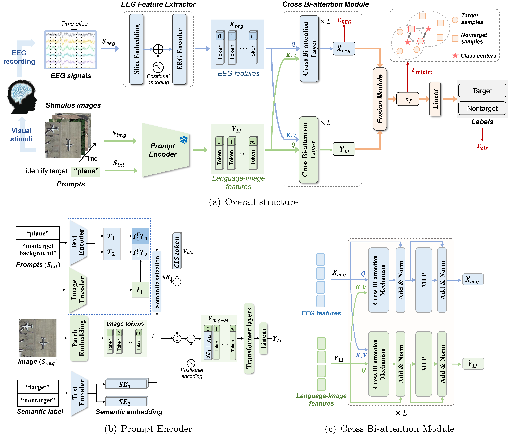

# ELIPformer

The official implementation of **Integrating Language-Image Prior into EEG Decoding for Cross-Task Zero-Calibration RSVP-BCI**.



The structure of the proposed ELIPformer. (a) ELIPformer consists of the feature extractor, the prompt encoder, the cross bi-attention module, and the fusion module. (b) The prompt encoder consists of components from the pre trained CLIP-ViT-B/32. The image encoder and text encoder are inherited from this model. Additionally, the patch embedding layer and transformer layers are derived from the image encoder in CLIP-ViT-B/32. (c) The cross bi-attention module is composed of L successive cross bi-attention layers for effective interaction between EEG features and language-image features.


## 1&nbsp; Installation

Follow the steps below to prepare the virtual environment.

Create and activate the environment:
```shell
conda create -n mtreenet python=3.10
conda activate ELIPformer
```

Install dependencies:
```shell
pip install -r requirements.txt
```


## 2&nbsp; Data

### 2.1&nbsp; Dataset

We designed and implemented three RSVP target image retrieval tasks to construct the “NeuBCI Target Retrieval RSVP-EEG Dataset” including EEG data and the corresponding stimulus images. Our collected dataset and corresponding data descriptions are released at [https://doi.org/10.57760/sciencedb.14812](https://doi.org/10.57760/sciencedb.14812).

Each participant's **electroencephalogram (EEG) data** are stored in `.npz` files, and **stimulus images** are also stored in `.npz` files. Each EEG and image file with the same file name corresponds to the same participant. Below is the dataset structure:

| Task | Modality | File Format | File Naming | Data Shape | Label Description |
|------|----------|-------------|-------------|------------|-------------------|
| Plane    | EEG      | `.npz`       | `S1.npz` ~ `S20.npz` | `(trials × channels × time)` | `0`: non-target, `1`: target |
| Plane    | IMG       | `.npz`       | `S1_1.npz` ~ `S20_2.npz` | `(trials × 3 × height × width)` | `0`: non-target, `1`: target |
| Car    | EEG      | `.npz`       | `S1.npz` ~ `S20.npz` | `(trials × channels × time)` | `0`: non-target, `1`: target |
| Car    | IMG       | `.npz`       | `S1_1.npz` ~ `S20_2.npz` | `(trials × 3 × height × width)` | `0`: non-target, `1`: target |
| People    | EEG      | `.npz`       | `S1.npz` ~ `S31.npz` | `(trials × channels × time)` | `0`: non-target, `1`: target |
| People    | IMG       | `.npz`       | `S1_1.npz` ~ `S31_2.npz` | `(trials × 3 × height × width)` | `0`: non-target, `1`: target |

```
/data 
┣ 📂 Plane
┃   ┣ 📂 EEG 
┃   ┃   ┣ 📜 S1.npz 
┃   ┃   ┣ 📜 S2.npz 
┃   ┃   ┣ 📜 ... 
┃   ┃   ┣ 📜 S20.npz 
┃   ┣ 📂 Image 
┃   ┃   ┣ 📜 S1_1.mat 
┃   ┃   ┣ 📜 S1_2.mat 
┃   ┃   ┣ 📜 ... 
┃   ┃   ┣ 📜 S20_2.mat

┣ 📂 Car
┃   ┣ 📂 EEG 
┃   ┃   ┣ 📜 S1.npz 
┃   ┃   ┣ 📜 S2.npz 
┃   ┃   ┣ 📜 ... 
┃   ┃   ┣ 📜 S20.npz 
┃   ┣ 📂 Image 
┃   ┃   ┣ 📜 S1_1.mat 
┃   ┃   ┣ 📜 S1_2.mat 
┃   ┃   ┣ 📜 ... 
┃   ┃   ┣ 📜 S20_2.mat

┣ 📂 People
┃   ┣ 📂 EEG 
┃   ┃   ┣ 📜 S1.npz 
┃   ┃   ┣ 📜 S2.npz 
┃   ┃   ┣ 📜 ... 
┃   ┃   ┣ 📜 S31.npz 
┃   ┣ 📂 Image 
┃   ┃   ┣ 📜 S1_1.mat 
┃   ┃   ┣ 📜 S1_2.mat 
┃   ┃   ┣ 📜 ... 
┃   ┃   ┣ 📜 S31_2.mat
```

### 2.2&nbsp; Data Acquisition

The EEG data are recorded using a SynAmp2 Amplifier (NeuroScan, Australia) with a 64-channel Ag/AgCl electrode cap following the international 10-20 system. The electrode impedances are maintained below 10 kΩ, with AFz serving as the ground electrode and the vertex as the reference. Data are sampled at 1000 Hz. Both EEG and eye movement signals are recorded simultaneously during the experiment. 


### 2.3&nbsp; Data Preprocessing

In the preprocessing stage, the EEG data for each block are down-sampled to 250 Hz. Subsequently, the signals are filtered using a 3-order Butterworth filter with linear phase implementation between 0.1 and 15 Hz, eliminating slow drift and high-frequency noise while preventing delay distortions. Then, the continuous EEG data are segmented into trials from the onset of the presented image to 1000 ms after the onset, and the EEG data of -200-0 ms are used for baseline correction.  In the Task plane and people, each subject contains approximately 560 target samples and 13440 nontarget samples. In the Task car, each subject contains approximately 320 target samples and 7680 nontarget samples.


## 3&nbsp; Train

The EMLPformer is optimized using the Adam optimizer, and the training process consists of two stages: in the first stage, the EEG decoding model is pre-trained by minimizing the EEG loss; in the second stage, the entire network is optimized by minimizing the overall loss, which includes the triplet loss with margin parameter α=0.5. The Adam optimizer uses an initial learning rate of 0.001, which is reduced by 20% every 10 epochs in the first stage and every 20 epochs in the second stage. We apply L2 regularization with a weight decay coefficient of 0.01. To ensure robustness in triplet loss mean centering, the batch size N is set to 64 in the first stage and 1024 in the second stage, with a maximum of 30 and 50 training epochs, respectively.

```bash
python -m torch.distributed.launch --master_port 29502 --nproc_per_node=2 /EMLPformer/main.py
```

## 4&nbsp; Cite

If you find this code or our ELIPformer paper helpful for your research, please cite our paper:

```bibtex
@article{li2025integrating,
  title={Integrating Language-Image Prior into EEG Decoding for Cross-Task Zero-Calibration RSVP-BCI},
  author={Li, Xujin and Wei, Wei and Qiu, Shuang and Zhang, Xinyi and Li, Fu and He, Huiguang},
  journal={arXiv preprint arXiv:2501.02841},
  year={2025}
}
```
